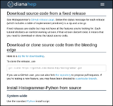
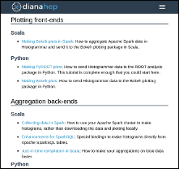
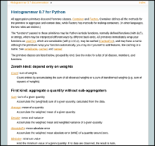

<h2><a href="install">Installation</a></h2>

Getting it.

<h2><a href="tutorials">Tutorials</a></h2>

How to analyse data with it.

<h2><a href="http://tigress-web.princeton.edu/~alexeys/python/latest/">Python reference</a></h2>

Sphinx docs for the latest version of Plasma-Python.

## Reporting bugs

Report implementation errors on the GitHub Issues tab:

   * Python: [plasma-python/issues](https://github.com/PPPLDeepLearning/plasma-python/issues)

Report errors in this documentation to [plasma-docs/issues](https://github.com/PPPLDeepLearning/plasma-docs/issues).
